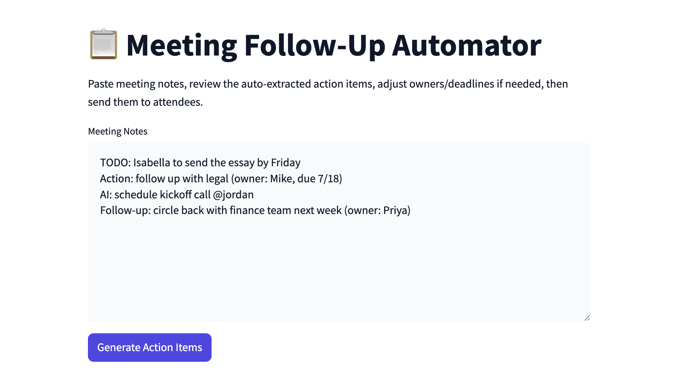
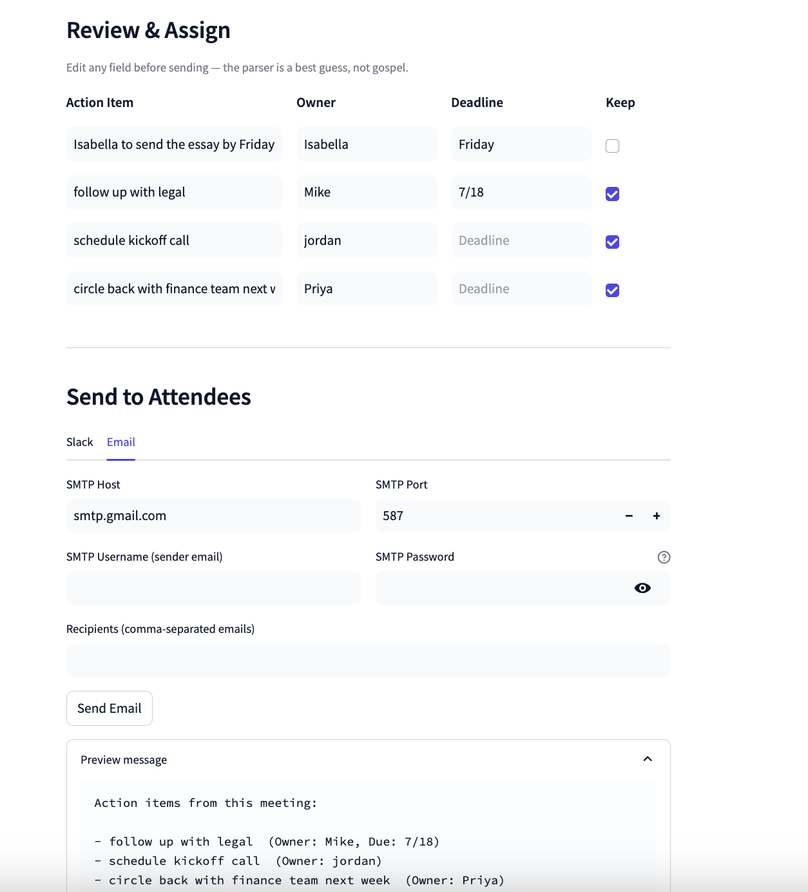

# Meeting Follow-Up Automator

<table>
<tr>
<td valign="middle" width="60%">
  
</td>
<td valign="middle" width="40%">
  
</td>
</tr>
</table>


A small Streamlit app that turns pasted meeting notes into a reviewable list
of action items (with owner + deadline guesses), lets you edit them, and
sends the final list to attendees via Slack or email. Built and deployed on
[Beam](https://beam.cloud).

> Built with the help of Claude for code, debugging, and this
> README — all testing and deployment on Beam was done first-hand.

## What it does

1. Paste raw meeting notes into the text box.
2. Click **Generate Action Items** — a regex-based parser (`parser.py`) pulls
   out lines that look like action items (`TODO:`, `Action:`, `AI:`,
   `Follow-up:`, checkbox lists, etc.) and best-guesses an owner (`@name`,
   `owner: name`, `Name to ...`) and deadline (`by Friday`, `due 7/18`,
   `EOD Monday`, ...).
3. Review/edit the results — fix a misattributed owner, add a row the
   parser missed by editing the fields directly, or uncheck "Keep" to drop
   a false positive before sending.
4. Send the final list to Slack (via an Incoming Webhook) or email (via SMTP)
   from the **Send to Attendees** section.

The parser is intentionally a fast, free, regex-based heuristic rather than
an LLM call — it won't catch every phrasing, but it's instant and has no
per-run cost, which felt like the right tradeoff for a tool you might run on
every meeting's notes. (An LLM-based extraction pass would be a natural v2 —
see "What I'd build next.")

## Project structure

```
app.py               Streamlit UI: paste notes → review/assign → send
parser.py             Regex-based action item / owner / deadline extraction
delivery.py            Slack webhook + SMTP email sending
start_server.py        Beam Pod deployment script
requirements.txt       Local dev dependencies
.env.example            Config vars the app reads (Slack webhook, SMTP creds)
.streamlit/config.toml   Light theme (indigo accent) for the Streamlit UI
```

The review/assign step is deliberately plain `st.text_input`/`st.checkbox`
rows rather than `st.data_editor` — see "Notes on building this" below for
why (short version: `data_editor`'s PyArrow dependency segfaulted in the
Beam container). No `pandas` in this app as a result.

## Running it locally

Because modern operating systems restrict global `pip` installations, it is highly recommended to run this app inside an isolated virtual environment.

1. **Clone the repository and navigate into the directory:**
   ```bash
   cd meeting-followup-automator
   ```

2. **Set up and activate a virtual environment:**
   ```bash
   # Create the environment folder
   python3 -m venv env

   # Activate it (macOS/Linux)
   source env/bin/activate

   # Activate it (Windows PowerShell)
   # .\env\Scripts\Activate.ps1
   ```

3. **Install dependencies and launch the app:**
   ```bash
   pip install -r requirements.txt
   streamlit run app.py
   ```

Open the URL Streamlit prints (usually `http://localhost:8501`). Paste some notes, e.g.:


```
TODO: Sarah to send the revised proposal by Friday
Action: follow up with legal (owner: Mike, due 7/18)
AI: schedule kickoff call @jordan
```

Slack/email credentials can be typed directly into the UI each session, or
pre-filled by copying `.env.example` to `.env`, filling it in, and running
`source .env` before `streamlit run app.py`.

## Deploying on Beam

1. Sign up at [beam.cloud](https://beam.cloud) and install the SDK/CLI:
   ```bash
   pip install beam-client
   beam config create default
   ```
   You'll be prompted for a Gateway Host/Port (accept the defaults) and a
   **Token** — get this from the dashboard under **Settings → API Keys →
   Create Key**. Note: key creation failed for me with a generic "Failed to
   create token" error until I added a payment method to the account, even
   though I was well within the free-credit tier. See "Notes on building
   this" below.
2. (Optional but recommended) Create secrets so Slack/email credentials
   don't need to be typed into the UI on every session:
   ```bash
   beam secret create SLACK_WEBHOOK_URL https://hooks.slack.com/services/...
   beam secret create SMTP_USER you@example.com
   beam secret create SMTP_PASSWORD your-app-password
   ```
   If you skip this, remove the `secrets=[...]` line in `start_server.py` —
   Beam may error trying to resolve secrets that don't exist.
3. From the project directory:
   ```bash
   python start_server.py
   ```
   This builds the container image (Streamlit + requests), starts a
   [`Pod`](https://docs.beam.cloud/v2/examples/streamlit) exposing port 8501,
   and prints a public URL — look for the
   `Container created successfully ===> pod-...` line, which has the full
   container ID (handy for the next step, since `beam container list`
   truncates long IDs in a narrow terminal).
4. Open the printed URL — that's the live app.
5. **When you're done testing, stop the container** — Pods don't shut
   themselves down until either the entrypoint process exits or 10 minutes
   pass with no active browser connection to the URL:
   ```bash
   beam container list      # confirm what's running
   beam container stop <container-id>
   ```
   Re-running `python start_server.py` to "check" something creates a
   **new** container each time rather than reusing the old one — I ended up
   with three running in parallel at one point from repeated test runs.

**Alternative (faster iteration while developing):** `beam serve app.py`
live-syncs local file changes to a remote container instead of rebuilding on
every change — worth using while tweaking the UI, then switching to
`start_server.py` / `beam deploy` once it's stable.

## What I'd build next (if I had more time)

- **LLM-based extraction** as an alternative to the regex parser, for notes
  that don't use consistent TODO/Action markers — probably as a toggle so
  the free/instant regex path stays the default.
- **Persistent history** of past meetings' action items (Beam's storage
  volumes, or just a small SQLite file), so the app is useful across
  multiple meetings instead of one paste-and-send session.
- **Per-owner routing**: instead of one Slack message with everything, DM
  each owner just their own items.
- **Auth** — right now anyone with the URL can use the app and (if secrets
  are configured) send messages as your Slack workspace / email account.
  Fine for a prototype, not fine for anything real.

## Notes on building this (confusing / unintuitive parts)

- **A container image build failed on a dependency conflict**
  (`Cannot uninstall blinker 1.4`) while installing Streamlit's own
  dependencies. Not a bug in this app's code — the image just needed the
  conflicting package resolved before the build would succeed. Worth
  knowing that image build failures show up as their own distinct step in
  the deploy output, separate from any app-level error.

- **Confirming a code change had actually reached the deployed container
  took a beat.** After editing `app.py` locally, the redeployed app
  initially still looked like the old version — turned out the save on
  disk hadn't fully gone through before Beam synced it, so Beam was
  faithfully deploying exactly what was on disk, just not what I thought
  was on disk. One instance of this was bad enough to reduce `app.py` down
  to effectively just `import streamlit as st`, which deployed and loaded
  a blank page rather than erroring — worth double-checking the actual
  file contents locally before assuming Beam did something wrong.

- **API key creation failed silently until billing was added.** Clicking
  "Create Key" in Settings just returned a generic "Failed to create token"
  toast — no indication that a payment method was the blocker. Adding a card
  (while still inside the free-credit tier) immediately fixed it. A clearer
  error message here would save real time.

- **`beam container` and `beam logs` aren't siblings, despite looking like
  they should be.** `beam container list` / `beam container stop <id>` work
  as expected, but `beam container logs <id>` doesn't exist — the actual
  command is `beam logs --container-id <id>` (or via the web dashboard's
  Containers tab). This wasn't obvious from the command structure and cost
  several failed attempts.

- **`beam logs` crashed outright on Python 3.14** with an
  `SSLError: [SSL: TLSV1_UNRECOGNIZED_NAME]` deep in the websocket
  connection code — not a usage error, a real crash in the CLI's own
  dependency stack. The web dashboard's log viewer worked fine as a
  fallback, which is how the actual app bug (below) got found.

- **Re-running `python start_server.py` creates a new container every
  time**, rather than updating/replacing a previous one. This is easy to
  miss if you're iterating quickly — I ended up with three Pods running in
  parallel at one point, discovered only via `beam container list`, from
  redeploying to test each change. `beam deploy` (a named, versioned
  deployment) is the abstraction that avoids this; the raw `Pod.create()`
  pattern from Beam's own Streamlit example doesn't warn about it.

- **Pods scale down after 10 minutes idle**, and the resulting dead URL just
  says "failed to connect to service" in the browser — indistinguishable
  from an actual crash. `beam container list` returning "no containers
  found" was the only way to confirm it wasn't running anymore, after the
  fact, with no way to retroactively pull logs from a container that's
  already gone.

- **The actual bug, once found:** the app's original "Review & Assign" table
  used `st.data_editor`, which relies on PyArrow to serialize the DataFrame
  to the browser. This segfaulted the whole Streamlit process a couple of
  minutes into the session — a hard native crash (`Segmentation fault (core
  dumped)`), not a Python exception, so nothing about it showed up as a
  normal traceback. Swapping to plain `st.text_input`/`st.checkbox` rows
  (no pandas, no PyArrow) fixed it. Worth flagging as a general risk: any
  Streamlit widget backed by a compiled binary dependency is a real
  crash-surface in a container environment, and the failure mode
  (segfault → container dies → generic "failed to connect") gives almost no
  signal pointing back to the actual cause.

## Product feedback

- The single biggest thing I'd change: **surface *why* a container died.**
  Whether it OOM'd, segfaulted, hit its 10-minute idle timeout, or was
  manually stopped, the user-facing result is identical ("failed to connect
  to service" / "no containers found"). A status field distinguishing
  "idled out" vs. "crashed" vs. "stopped" on `beam container list` would
  have saved most of the debugging time in this project.
- **`beam logs` should not crash on a supported Python version** — if 3.14
  isn't fully supported yet, a clear version-compatibility error at CLI
  startup would be much better than an unhandled SSL exception several
  layers deep.
- The **CLI command tree is inconsistent** in places (`beam container list`
  / `stop` vs. `beam logs --container-id`, rather than `beam container
  logs`) — worth a pass for consistency, since it's the kind of thing users
  reach for constantly while debugging.
- On the positive side: `beam container list`, `beam container stop`, and
  the web dashboard's per-container log viewer were all reliable once I
  found them, and the `Pod` abstraction itself (image + entrypoint + ports)
  mapped cleanly onto "just run my existing Streamlit app" with almost no
  changes to the app code itself — the friction was almost entirely in
  observability/debugging tooling, not the core deploy model.
